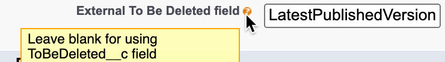

# SObject Purge Framework

This framework allows users to configure some data purge operations.

# Disclaimer
SObject Purge Framework is not an official Salesforce product, it has not been officially tested or documented by Salesforce.

## How Do You Configure SObject Purge Framework ?

The configuration is based on two parts:
- The delete logic.
- The custom metadata records.

### Delete logic

The logic can be configured in two places
- By default, a checkbox (formula) field named "ToBeDeleted__c" on the object to purge.
-  **Or** a boolean field on a related object to insert in the CMDT field ExternalToBeDeletedField__c.

<em>ie LatestPublishedVersion.ToBeDeleted__c to delete ContentDocument based on ContentVersion field.</em>
### Custom Metadata Records

PurgeSObjectSetting__mdt : Custom Metadata which contains the SObjects to purge and the sequence to adress the deletion.
- Sequence__c : Allow user to set the execution order for the purge, useful if we have to delete childs objects before the main one.
- ExternalToBeDeletedField__c : Allow user to reference a field which contains delete logic on a related object.
- PublishPlatformEventOk__c : if checked, a platform event will be published on sucess.
- PublishPlatformEventKo__c : if checked, a platform event will be published on failure.
- PlatformEventExternalId__c : Field API name of the record external id.

Platform event example
``` json
{
  "data": {
    "schema": "PYnPMKjl73Qx3gYURNrang",
    "payload": {
      "CreatedById": "0057a00000CsmbuAAB",
      "Success__c": true,
      "Message__c": null,
      "CreatedDate": "2022-10-14T07:13:03.051Z",
      "SObject__c": "Account",
      "ExternalId__c": "37",
      "Id__c": "0017a00002556lhAAA"
    },
    "event": {
      "EventUuid": "3e74df29-9a31-4463-8639-f460e5dd9cff",
      "replayId": 2682310,
      "EventApiName": "PurgeSObjectBatch__e"
    }
  },
  "channel": "/event/PurgeSObjectBatch__e"
}
```

### To add a new SObject to the list

- Create a Boolean formula field named `ToBeDeleted__c` and define the criteria to purge the SObject. If your criteria are too complex to be addressed by a formula, you can create a boolean field and handle the logic in a flow or an apex trigger.
- Create a new custom metadata in PurgeSObjectSettings by entering the SObject **API Name** and the sequence to purge the object.


[](./screenshots/settings.png)

## Particular Use Cases

For some particular SObjects, ContentDocument for example, you can't create custom field on it.

You can use a field from another object since this field is referenced in the object.

For our use case, we referenced the ContentVersion's field from the ContentDocument to handle the deletion: LatestPublishedVersion.ToBeDeleted__c

[](./screenshots/externalToBeDeleted.png)

## How To Run SObject Purge Framework ?

- Schedule the `PurgeSObjectBatchSchedulable` class
	- Apex Classes > 'Schedule Apex' button > Enter `PurgeSObjectBatchSchedulable`

[](./screenshots/schedule.png)

## Deploy to Salesforce

Checkout the repo and deploy it with sfdx:
```sh
sfdx force:source:deploy -p force-app
```

Use GitHub Salesforce Deploy Tool:

[](https://githubsfdeploy.herokuapp.com/?owner=tprouvot&repo=purge-sobject&ref=master)
