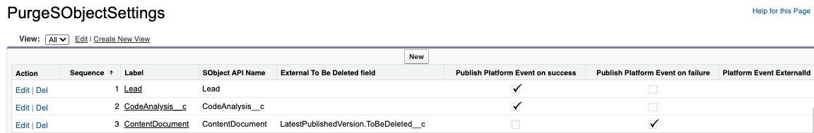

# SObject Purge Framework

This framework allows users to configure some data purge operations.

# Disclaimer
SObject Purge Framework is not an official Salesforce product, it has not been officially tested or documented by Salesforce.

## How Do You Configure SObject Purge Framework ?

The configuration is based on two parts:

- PurgeSObjectSetting__mdt : Custom Metadata which contains the SObjects to purge and the sequence to adress the deletion.
- ToBeDeleted__c : formula field which contains the deletion rules.
- PublishPlatformEventOk__c : if checked, a platform event will be published on failure.
- PublishPlatformEventKo__c : if checked, a platform event will be published on sucess.
- PlatformEventExternalId__c : Field API name of the record external id.

### To add a new SObject to the list

- Create a Boolean formula field named `ToBeDeleted__c` and define the criteria to purge the SObject. If your criteria are too complex to be addressed by a formula, you can create a boolean field and handle the logic in a flow or an apex trigger.
- Create a new custom metadata in PurgeSObjectSettings by entering the SObject **API Name** and the sequence to purge the object.


[](./screenshots/settings.png)

## How To Run SObject Purge Framework ?

- Schedule the `PurgeSObjectBatchSchedulable` class
	- Apex Classes > 'Schedule Apex' button > Enter `PurgeSObjectBatchSchedulable`

[](./screenshots/schedule.png)

## Deploy to Salesforce

Checkout the repo and deploy it with sfdx:
```sh
sfdx force:source:deploy -p force-app
```

Use GitHub Salesforce Deploy Tool:

[](https://githubsfdeploy.herokuapp.com/?owner=tprouvot&repo=purge-sobject&ref=master)
